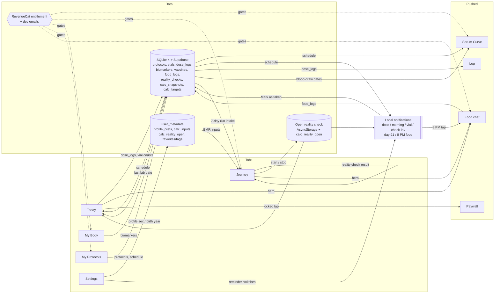

# DoseTrace — App map: cross-tab and cross-module data flows (draft)

- Drafted 27 Sep 2026 from `main` @ 902c9ea (read-only review).
- Purpose: every place where data made in one tab or module is used by another. **Each link should get a test.** When a change touches the "From" or "To" code, re-check the link.
- "Existing test" gives the file that covers the link's logic. `(logic only)` means the test covers the pure function, not the screen wiring that connects the two ends. `NONE` means nothing covers the link.
- No test in the repo renders a screen or drives the app end to end. Every test in `__tests__/` is a pure-function or sync-harness test. So even links with a test path have untested wiring.

## Diagram (tabs and main links)

Your goal chain (founder, 27 Sep): **Food chat → food_logs → `intakeRun` (7 consecutive complete days) → reality-check intake (tap to use) → `realityCheckTDEE` → saved `reality_checks` → `scoreCheck` → `goalsForTdee` → Your daily plan "Measured"**. Links L-17, L-18, L-19.

## Links

| ID | From | To | What data | Where in code (file + function) | Existing test | Risk if broken |
|---|---|---|---|---|---|---|
| L-01 | My Protocols (protocol row) | Today: due doses, ring, streak, adherence | `start_date`, `interval_days`, `doses_per_day`, times, `created_at` | `ProtocolsScreen.js` save (`insertProtocol`/`updateProtocol`) → `TodayScreen.js` render + `fetchStreakData` via `lib/schedule.js` `expectedDosesOn`, `nextDoseAt`, `existedOn` | `__tests__/schedule.test.js` (logic only) | Wrong or missing doses on Today; streak and adherence wrong. |
| L-02 | My Protocols (schedule) | Serum Curve | Same schedule + dose, unit, `compound_id` (blend split) | `SerumCurveScreen.js` load: `getActiveProtocols` → `expectedDosesOn`, `getHalfLifeEntry`, `doseInCurveUnit`, `blendComponents` | `__tests__/schedule.test.js`, `__tests__/halfLives.test.js`, `__tests__/compounds.test.js` (logic only) | The Premium moat shows a wrong curve. Past dates use the current dose (F2). |
| L-03 | My Protocols (schedule) | Dose reminders | Due dates and slot times | `lib/notifications.js` `scheduleDoseReminder` / `syncAllDoseReminders` → `lib/notificationPlan.js` `dueDateKeys` | `__tests__/notificationPlan.test.js` (dueDateKeys) | Reminders on the wrong days. This is a **second schedule implementation**: `dueDateKeys` honors `schedule_total`, `expectedDosesOn` does not. |
| L-04 | My Protocols (schedule) | Morning summary notification (07:00) | Names of protocols due / days to next dose | `lib/notifications.js` `syncMorningSummary` → `morningSummaryPlan` | `__tests__/notificationPlan.test.js` | Wrong or missing morning list. Only re-planned on app open/foreground, not on protocol save. |
| L-05 | My Protocols (schedule) + dose_logs | Missed-dose rows (Today, Log, streaks) | Slots 12 h+ past with no log become "Missed" | `lib/doseActions.js` `scanMissedDoses` → `lib/missedDoses.js` `computeMissedDoses`, `lib/schedule.js` `expectedSlotTimesOn` | `__tests__/missedDoses.test.js` | False "Missed" rows or real misses hidden. |
| L-06 | My Protocols (past start date) | dose_logs (back-filled Taken) → Today streaks, Log | One Taken row per elapsed slot | `ProtocolsScreen.js` save → `lib/doseActions.js` `backfillTakenDoses` → `elapsedDoseSlots` | `__tests__/schedule.test.js` (elapsedDoseSlots only); `backfillTakenDoses` NONE | Duplicate or missing history (idempotency was flagged as deferred in STATE.md). |
| L-07 | Today (Mark taken) | dose_logs, vials.doses_taken, protocols.units_taken → Log, streaks, Protocols card "doses left", supply alerts | New Taken row, vial count +1, oral units | `TodayScreen.js` `markTaken` (+ undo) | NONE | Wrong history and supply counts. |
| L-08 | Dose notification "Mark as taken" | Same as L-07 | Taken row for the reminder's own day/slot; flips a Missed row; idempotent | `lib/notificationActions.js` `markTaken` → `lib/doseActions.js` `recordDoseTaken` | NONE | Double logging or logging on the wrong day. **Logic duplicated with L-07** ("mirrors TodayScreen.markTaken"), and the two already behave differently (see findings). |
| L-09 | dose_logs | Log screen, Today streak/adherence, week dots | Taken/Skipped/Missed rows | `LogScreen.js` (`getAllLogs`, `getLogsSince`); `TodayScreen.js` `fetchStreakData`, `fetchProtocolStreaks` | NONE | History or streak not matching reality. |
| L-10 | dose_logs (Taken today) | Cancels today's pending reminders | Taken count per protocol | `TodayScreen.js` → `lib/notifications.js` `cancelTodaysDoseReminders` | NONE | "Dose pending" notifications after the dose was taken. |
| L-11 | Vials (Protocols / Today) | Today alerts: supply low (≤3 doses), vial expiry | `total_doses` (or derived capacity), `doses_taken`, `mixed_on` + validity | `TodayScreen.js` `alerts` useMemo; `lib/vialExpiry.js` `daysUntilExpiry` | `__tests__/vialExpiry.test.js` (expiry logic only); supply rule NONE | Missed restock warning. |
| L-12 | Vials | Push "vial low" notification (≤2 doses) | `total_doses`, `doses_taken` | `lib/notifications.js` `syncVialAlerts` | NONE | Different rule from L-11 (≤2 vs ≤3; skips vials with no `total_doses`, which Today derives). |
| L-13 | Today (new-vial prompt) | vials (new row) **and** protocols.start_date → curve, adherence, reminders | `mixed_on`, `total_doses`, **overwrites `start_date`** | `TodayScreen.js` new-vial handler, line 805 `updateProtocol(..., { start_date: mixDate })` | NONE | **Live defect (journey-review F4):** rewrites curve and adherence history whenever a new vial is mixed. |
| L-14 | My Body (biomarkers) | Serum Curve blood-draw readout | Distinct `report_date` values | `SerumCurveScreen.js` load: `getBiomarkers` → `labDates` | NONE | Blood-draw dates missing from the curve cross-reference. |
| L-15 | My Body (biomarkers) | Today "bloodwork due" alert → My Body › Labs | Latest `report_date` (182-day rule) | `TodayScreen.js` load (`getBiomarkers`), `alerts`; `navigation.navigate('Body', { initialSection: 'labs' })` → `BodyScreen.js` `initialSection` effect | NONE | Alert never appears, or the tap lands on the hub instead of Labs. |
| L-16 | Protocols, dose_logs, vials, biomarkers, vaccines | Exports (My Body CSV/PDF, Settings export) | All records | `lib/database.js` `getAllDataForExport`; `lib/exportRecords.js`; `BodyScreen.js`, `SettingsScreen.js` `handleExportData` | `__tests__/exportRecords.test.js` (builders only) | Export silently incomplete. food_logs, reality_checks, calc_snapshots, calc_targets are **not** exported. |
| L-17 | Food chat (food_logs + day_closed / not_recorded markers) | Journey reality check intake (tap to use, with working) | Average kcal of the most recent run of 7+ consecutive complete days inside the check | `CalculatorSection.js` `load` (`getFoodLogsSince`) → `foodRun` = `lib/nutrition.js` `intakeRun` → "use my log" button → `rcIntake` → `computeReality` | `__tests__/nutrition.test.js` (intakeRun), `__tests__/energyCalc.test.js` (realityCheckTDEE) (logic only) | The whole food log → reality check → Your goal chain breaks (FL-3, FL-30). |
| L-18 | Journey reality check (result) | Journey Your daily plan (Measured) | Measured TDEE, weekly rate → Lose/Maintain/Gain kcal with safety floor | `CalculatorSection.js` `scoreCheck` → `effectiveGoals` (`lib/energyCalc.js` `goalsForTdee`) | `__tests__/energyCalc.test.js` (goalsForTdee, logic only) | Daily plan stays "Estimated", or a measured plan skips the calorie floor. |
| L-19 | Journey (saved reality checks) | Your daily plan on later visits / other devices | `reality_checks` rows (latest wins) | `CalculatorSection.js` `saveRealityCheck` → `lib/database.js` `upsertRealityCheck`; read in `load` | `__tests__/sync.test.js` (reality_checks round-trip + tombstone) | Measured plan lost after reinstall or on a second device. |
| L-20 | Journey (reality check start/stop) | Today reality-check alert (due date = start + 21) | Open weigh-in `{date, weightKg}` | `lib/realityCheck.js` `setRealityStart`/`getRealityStart` → `TodayScreen.js` load + `alerts`; Today can also cancel it (`clearRealityStart`) | NONE | Alert shows for a stopped check, or never shows. |
| L-21 | Journey (reality check start) | Day-21 weigh-in notification → Journey | Start date | `lib/notifications.js` `syncRealityCheckReminder` (reads AsyncStorage `RC_START_KEY` only); `App.js` listener `reality_check` → Journey | NONE | No weigh-in reminder; the check never finishes. |
| L-22 | Journey (reality check start) + food_logs (closed days) + access | 8 PM food question schedule | Start date, closed days, `access.canLog/until` | `lib/notifications.js` `syncFoodLogReminder` → `foodNudgeDays`, `closedDays`, `remindersForAccess` | `__tests__/notificationPlan.test.js` | Reminders for users not in a check, or locked users nagged (FL-18, FL-41). |
| L-23 | Reality check start + access | Today food-log hero visibility and text | `rcStart`, day of check, today's summary | `FoodLogHero.js` → `lib/foodThread.js` `todayFoodHeroPolicy`, `todaySummary` | `__tests__/foodThread.test.js` | Hero shows outside a check, or is missing during one (FL-33, FL-43). |
| L-24 | Entitlement + free-start marker + reality check start | Food access everywhere: chat, both heroes, Journey reality check (`rcFree`), 8 PM reminder | `premium`, Premium end date, first-use day, grace week | `lib/foodLogActions.js` `loadFoodAccess`, `ensureFreeStart` → `lib/foodThread.js` `foodLogAccess`, `freeStartDay`, `resolveEntitlement` | `__tests__/foodThread.test.js` | Free users locked early, or given unlimited access; paying users locked on a network blip (FL-41). |
| L-25 | 8 PM food notification (tap, "Log it") | Food chat with the evening question | `eveningDay`, nonce | `App.js` `routeFoodTap` (listener + `getLastNotificationResponseAsync`, held until `Main` exists) → `FoodChatScreen.js` `route.params.eveningDay` | `__tests__/notificationPlan.test.js` (foodTapParams, responseKey); App.js wiring NONE | Tap opens the app but not the chat (cold start is the fragile path). |
| L-26 | 8 PM notification "Nothing else today" | food_logs `day_closed` marker → intake run, reminder cancelled | Local day key | `lib/notificationActions.js` `closeFoodDayFromNotification` → `lib/notifications.js` `closeFoodDay` → `insertFoodDayMarker` | `__tests__/notificationPlan.test.js` (closed day skipped), `__tests__/nutrition.test.js` (closed day counts); handler NONE | Day not closed → breaks the 7-day run; reminder repeats. |
| L-27 | Food chat ("That's all for today" / typed "that's it") | Same `day_closed` marker | Local day key | `FoodChatScreen.js` → `closeFoodDay` | `__tests__/nutrition.test.js` (isDoneText, pickDayQuestion) (logic only) | Same as L-26. |
| L-28 | Sync (food logged on another device) | Re-plan 8 PM reminder | Sync-complete event | `App.js` `addSyncListener` → `syncFoodLogReminder` (throttled 30 s) | NONE | Phone still asks about a day already closed on the iPad. |
| L-29 | Settings / Onboarding profile (user_metadata `gender`, `birth_year`) | Journey BMR (Mifflin) and sex gate | Sex at birth, age | `CalculatorSection.js` `load` (meta → `setSex`, `setProfileSex`, `setAge`) → `energyPlan` | `__tests__/energyCalc.test.js` (Mifflin, logic only); wiring NONE | Wrong BMR. **`calc_inputs.sex/age` override the profile** (see findings). |
| L-30 | Journey sex-gate prompt | user_metadata `gender` → Settings profile | Sex | `CalculatorSection.js` `saveProfileSex` | NONE | Profile and calculator disagree. |
| L-31 | Journey Progress snapshots (incl. "add a past weigh-in") | Your target ETA | Dated weight / BF series, ≥14-day window | `CalculatorSection.js` `weightRate`/`bfRate` (`seriesRatePerWeek`) → `targetProjection` | `__tests__/energyCalc.test.js`, `__tests__/sync.test.js` (calc_targets) | Wrong or missing ETA. Reality-check weigh-ins are **not** written as snapshots, so they never feed the ETA. |
| L-32 | Progress snapshots | Reality-check start weight pre-fill | Weigh-in on the chosen start day | `CalculatorSection.js` `shiftRcStartDate` → `lib/realityCheckRules.js` `weighInOn`, `prefillStartWeight` | `__tests__/realityCheckRules.test.js` | Typed weight overwritten, or no pre-fill. |
| L-33 | Progress snapshots | Progress chart + "since first snapshot" line | Weight, waist | `CalculatorSection.js` `chartSeries`, `progressSummary` → `ProgressChart.js` | NONE | Chart wrong after a unit switch or sync. |
| L-34 | Entitlement, strict (`isPremium`) | Gates: curve (Journey card, Body card, Log button, SerumCurve itself), Progress snapshots, target ETA, PDF export, 2nd+ lab upload, more than 3 protocols, vaccine scan | Premium yes/no (dev emails first) | `lib/purchases.js` `isPremium`; callers in `JourneyScreen.js`, `BodyScreen.js`, `LogScreen.js`, `SerumCurveScreen.js`, `CalculatorSection.js`, `ProtocolsScreen.js`, `VaccinesSection.js` | NONE | Paid features free, or paying users locked out. Returns **false when RevenueCat can't be reached**, unlike L-24. |
| L-35 | Paywall purchase / restore | All gated screens | New entitlement | `PaywallScreen.js` → RevenueCat; each screen re-reads `isPremium` on focus | NONE | User pays but stays locked until the screen is re-focused or the app restarts. |
| L-36 | Settings notification switches (user_metadata) | All local notifications | `dose_reminders`, `vial_alerts`, `checkin_reminders`, `food_reminders`, `persistent_reminders`, `notif_show_names` | `SettingsScreen.js` `toggleNotificationPref` → `syncAllNotifications`; read in each `sync*` in `lib/notifications.js`; the food switch also in `NutritionLogger.js` | NONE | Switch doesn't stop reminders (it happened before: 7428909). |
| L-37 | Settings language | Notification text | Stored language | `lib/notifications.js` `getT` | `__tests__/i18n.test.js` (keys only) | Notifications in the wrong language. |
| L-38 | Onboarding answers (stored locally) | Account profile (user_metadata) on first sign-in | name, sex, birth, goal, activity… | `App.js` SIGNED_IN → `lib/onboardingStore.js` `applyPendingProfile` | NONE | New user sent back to the profile gate, or another account's answers leak (fixed once in 8cb6ef7). |
| L-39 | Auth events | Sync engine, full import, local wipe, notification scheduling, RevenueCat identity | Session / user id | `App.js` `onAuthStateChange` (sync, deferred side-effects), cold-start `getSession` block | `__tests__/deleteUserCoverage.test.js` (wipe covers tables); intended-vs-accidental guard NONE | Data loss on a session hiccup, or cross-account leak. |
| L-40 | Local SQLite | Supabase (9 synced tables) and back | Rows, tombstones, watermark | `lib/syncCore.js` `pushPending`, `pullChanges`, `fullImport`; `lib/sync.js`; `lib/syncMappers.js` | `__tests__/sync.test.js`, `__tests__/syncMappers.test.js` | Data lost or duplicated across devices. |
| L-41 | Settings delete account | Server erasure of every synced table | user id | `SettingsScreen.js` → `supabase/functions/delete-user` | `__tests__/deleteUserCoverage.test.js` | GDPR erasure incomplete. |
| L-42 | Notification taps (dose, check-in, day-21) | Today / Journey | `data.type` | `App.js` `addNotificationResponseReceivedListener` | NONE | Tap opens the wrong screen. Morning summary and vial-low taps have no route at all. |
| L-43 | Body map (Today, Log) | dose_logs.site → next-site suggestion | Injection site ids | `BodyMapModal.js`; `lib/injectionSites.js` `serializeForStorage`, `suggestNextSite`, `summarizeStored` | NONE | Site history lost or rotation suggestion wrong. |
| L-44 | Today alerts / cards | Journey, My Body › Labs, Protocols (open a card), Log | Route + params (`initialSection`, `openProtocolId`) | `TodayScreen.js` `navigation.navigate(...)`; `BodyScreen.js`, `ProtocolsScreen.js` param effects | NONE | Dead-end taps. |
| L-45 | AI consent | Every AI call: lab scan, vaccine scan, vial scan, food chat | Consent flag (v3) | `lib/aiConsent.js` `requestAIConsent` in `BodyScreen.js`, `VaccinesSection.js`, `ProtocolsScreen.js`, `FoodChatScreen.js` | NONE | Data sent to the AI provider without consent (Apple 5.1.1/5.1.2). |
| L-46 | Protocol delete | Dose reminders + snoozed copies cancelled | Protocol id | `ProtocolsScreen.js` delete → `cancelDoseReminder`; snooze pruning in `lib/notifications.js` | NONE | Reminders for a deleted protocol. |
| L-47 | Journey "Stop reality check" | Clears open check + saved checks; cancels day-21 and 8 PM reminders; keeps food logs | — | `CalculatorSection.js` `stopRealityCheck` → `clearRealityStart`, `clearRealityChecks`, `syncRealityCheckReminder`, `syncFoodLogReminder` | NONE | Reminders keep firing after Stop, or food logs deleted. |
| L-48 | Reality check start (user_metadata `calc_reality_open`) + push tokens | Server push reminders (dormant) | Start date, timezone | `supabase/functions/send-reminders/plan.ts` (port of `lib/notificationPlan.js`); gated by `usesServerPush()` | NONE (never run) | When switched on: double or wrong reminders. The port has already drifted (A-04). |
| L-49 | food_logs | Today hero summary; Journey totals (today / 7 days / whole check); grace note | Items, kcal, per day | `lib/foodThread.js` `todaySummary`; `lib/nutrition.js` `periodTotals`; `NutritionLogger.js`, `FoodGraceNote.js` | `__tests__/foodThread.test.js`, `__tests__/nutrition.test.js` (logic only) | Totals disagree between Today and Journey. |
| L-50 | Food chat (catch-up, offline rows) | Re-parse on chat open / hero focus / reconnect | Rows typed on this device, pending follow-ups | `lib/foodLogActions.js` `catchUpFood`, `reparseRow`; `FoodLogHero.js`; `FoodChatScreen.js` | `__tests__/nutrition.test.js` (rowsToReparse) (logic only) | Offline entries stuck or lost (FL-19, FL-46). |

## Counts
- Links: **50**.
- `NONE` (no test at all): **24** — L-07, L-08, L-09, L-10, L-12, L-13, L-14, L-15, L-20, L-21, L-28, L-30, L-33, L-34, L-35, L-36, L-38, L-42, L-43, L-44, L-45, L-46, L-47, L-48.
- Partly covered (some pieces NONE, or logic only for the key piece): L-06, L-11, L-25, L-26, L-29, L-39.
- The other 20 have a logic test, but no screen-level test.

## Suggested first tests (cheapest, highest value)
1. L-13: a unit test that the new-vial path never changes `start_date` (after moving the logic into `lib/`).
2. L-07/L-08: put mark-taken in one `lib/` function used by both Today and the notification; test idempotency, Missed-row flip, vial and oral counts.
3. L-17→L-18: one pure "chain" test: food rows → `intakeRun` → `realityCheckTDEE` → `goalsForTdee` → Measured plan.
4. L-34 + L-24: one `entitlement()` helper for both strict and lenient paths, tested for "store unreachable".
5. L-20/L-21/L-47: test `lib/realityCheck.js` start/stop against a fake AsyncStorage + metadata, and that stop clears both reminders.
